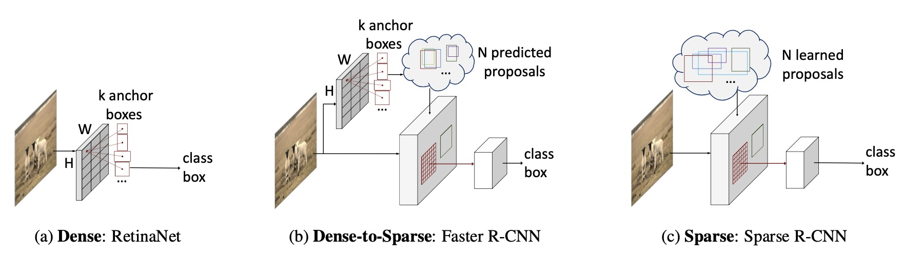

## Sparse R-CNN: End-to-End Object Detection with Learnable Proposals

[](https://opensource.org/licenses/MIT)



## Paper (CVPR 2021)
[Sparse R-CNN: End-to-End Object Detection with Learnable Proposals](https://arxiv.org/abs/2011.12450)

## Updates
- (02/03/2021) Higher performance is reported by using stronger backbone model [PVT](https://github.com/whai362/PVT). 
- (23/02/2021) Higher performance is reported by using stronger pretrain model [DetCo](https://github.com/xieenze/DetCo). 
- (02/12/2020) Models and logs(R101_100pro_3x and R101_300pro_3x) are available. 
- (26/11/2020) Models and logs(R50_100pro_3x and R50_300pro_3x) are available.
- (26/11/2020) Higher performance for Sparse R-CNN is reported by setting the dropout rate as 0.0. 

## Models
Method | inf_time | train_time | box AP | download
--- |:---:|:---:|:---:|:---:
[R50_100pro_3x](projects/SparseRCNN/configs/sparsercnn.res50.100pro.3x.yaml) | 23 FPS | 19h  | 42.8 | [model](https://drive.google.com/drive/u/1/folders/19UaSgR4OwqA-BhCs_wG7i6E-OXC5NR__) \| [log](https://drive.google.com/drive/u/1/folders/19UaSgR4OwqA-BhCs_wG7i6E-OXC5NR__)
[R50_300pro_3x](projects/SparseRCNN/configs/sparsercnn.res50.300pro.3x.yaml) | 22 FPS | 24h  | 45.0 | [model](https://drive.google.com/drive/u/1/folders/19UaSgR4OwqA-BhCs_wG7i6E-OXC5NR__) \| [log](https://drive.google.com/drive/u/1/folders/19UaSgR4OwqA-BhCs_wG7i6E-OXC5NR__)
[R101_100pro_3x](projects/SparseRCNN/configs/sparsercnn.res101.100pro.3x.yaml) | 19 FPS | 25h  | 44.1 | [model](https://drive.google.com/drive/u/1/folders/19UaSgR4OwqA-BhCs_wG7i6E-OXC5NR__) \| [log](https://drive.google.com/drive/u/1/folders/19UaSgR4OwqA-BhCs_wG7i6E-OXC5NR__)
[R101_300pro_3x](projects/SparseRCNN/configs/sparsercnn.res101.300pro.3x.yaml) | 18 FPS | 29h  | 46.4 | [model](https://drive.google.com/drive/u/1/folders/19UaSgR4OwqA-BhCs_wG7i6E-OXC5NR__) \| [log](https://drive.google.com/drive/u/1/folders/19UaSgR4OwqA-BhCs_wG7i6E-OXC5NR__)

Models and logs are available in [Baidu Drive](https://pan.baidu.com/s/1v1g5JKPmn0rqiGGAvYHYvw) by code wt9n.

#### Notes
- We observe about 0.3 AP noise.
- The training time is on 8 GPUs with batchsize 16. The inference time is on single GPU. All GPUs are NVIDIA V100.
- We use the models pre-trained on imagenet using torchvision. And we provide [torchvision's ResNet-101.pkl](https://drive.google.com/drive/u/1/folders/19UaSgR4OwqA-BhCs_wG7i6E-OXC5NR__) model. 
More details can be found in [the conversion script](tools/convert-torchvision-to-d2.py).


Method | inf_time | train_time | box AP | codebase
--- |:---:|:---:|:---:|:---:
[R50_300pro_3x](projects/SparseRCNN/configs/sparsercnn.res50.300pro.3x.yaml) | 22 FPS | 24h  | 45.0 | [detectron2](https://github.com/facebookresearch/detectron2)
[R50_300pro_3x.detco](projects/SparseRCNN/configs/sparsercnn.res50.300pro.3x.detco.yaml) | 22 FPS | 28h  | 46.5 | [detectron2](https://github.com/facebookresearch/detectron2)
[PVTSmall_300pro_3x](https://github.com/whai362/PVT) | 13 FPS | 50h  | 45.7 | [mmdetection](https://github.com/open-mmlab/mmdetection)
[PVTv2-b2_300pro_3x](https://github.com/whai362/PVT/blob/v2/detection/configs/sparse_rcnn_pvt_v2_b2_fpn_300_proposals_crop_mstrain_480-800_3x_coco.py) | 11 FPS | 76h | 50.1 | [mmdetection](https://github.com/open-mmlab/mmdetection)


## Installation
The codebases are built on top of [Detectron2](https://github.com/facebookresearch/detectron2) and [DETR](https://github.com/facebookresearch/detr).

#### Requirements
- Linux or macOS with Python ≥ 3.6
- PyTorch ≥ 1.5 and [torchvision](https://github.com/pytorch/vision/) that matches the PyTorch installation.
  You can install them together at [pytorch.org](https://pytorch.org) to make sure of this
- OpenCV is optional and needed by demo and visualization

#### Steps
1. Install and build libs
```
git clone https://github.com/PeizeSun/SparseR-CNN.git
cd SparseR-CNN
python setup.py build develop
```

2. Link coco dataset path to SparseR-CNN/datasets/coco
```
mkdir -p datasets/coco
ln -s /path_to_coco_dataset/annotations datasets/coco/annotations
ln -s /path_to_coco_dataset/train2017 datasets/coco/train2017
ln -s /path_to_coco_dataset/val2017 datasets/coco/val2017
```

3. Train SparseR-CNN
```
python projects/SparseRCNN/train_net.py --num-gpus 8 \
    --config-file projects/SparseRCNN/configs/sparsercnn.res50.100pro.3x.yaml
```

4. Evaluate SparseR-CNN
```
python projects/SparseRCNN/train_net.py --num-gpus 8 \
    --config-file projects/SparseRCNN/configs/sparsercnn.res50.100pro.3x.yaml \
    --eval-only MODEL.WEIGHTS path/to/model.pth
```

5. Visualize SparseR-CNN
```    
python demo/demo.py\
    --config-file projects/SparseRCNN/configs/sparsercnn.res50.100pro.3x.yaml \
    --input path/to/images --output path/to/save_images --confidence-threshold 0.4 \
    --opts MODEL.WEIGHTS path/to/model.pth
```
## Third-party resources
- mmdetection implementation: [sparse_rcnn](https://github.com/open-mmlab/mmdetection/tree/master/configs/sparse_rcnn). Thank [Shilong Zhang](https://github.com/jshilong)!
- cvpod implementation:[sparse_rcnn](https://github.com/Megvii-BaseDetection/cvpods/tree/0927bdcf8d0ae62e8f8d39ba808fa072ee793034/playground/detection/coco/sparse_rcnn). Thank [Benjin Zhu](https://github.com/poodarchu)!
- paddledetection implementation:[sparse_rcnn](https://github.com/PaddlePaddle/PaddleDetection/tree/release/2.2/configs/sparse_rcnn). Thank [FL77N](https://github.com/FL77N/)!

## License

SparseR-CNN is released under MIT License.


## Citing

If you use SparseR-CNN in your research or wish to refer to the baseline results published here, please use the following BibTeX entries:

```BibTeX

@article{peize2020sparse,
  title   =  {{SparseR-CNN}: End-to-End Object Detection with Learnable Proposals},
  author  =  {Peize Sun and Rufeng Zhang and Yi Jiang and Tao Kong and Chenfeng Xu and Wei Zhan and Masayoshi Tomizuka and Lei Li and Zehuan Yuan and Changhu Wang and Ping Luo},
  journal =  {arXiv preprint arXiv:2011.12450},
  year    =  {2020}
}

```
